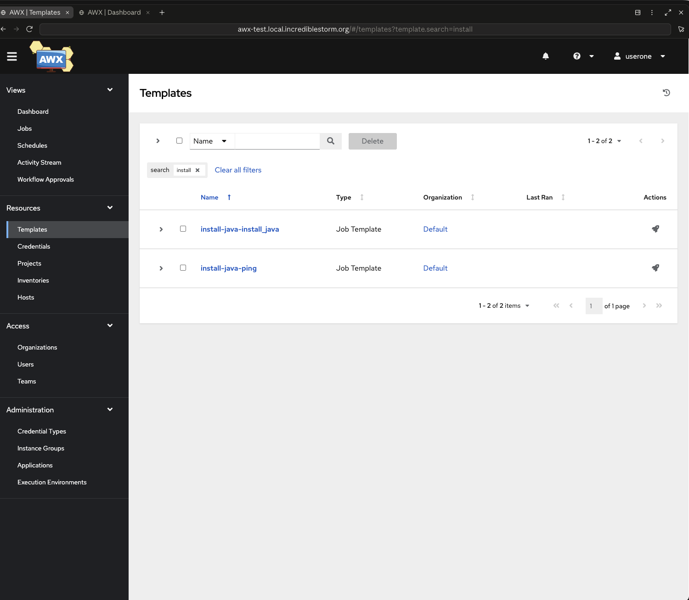
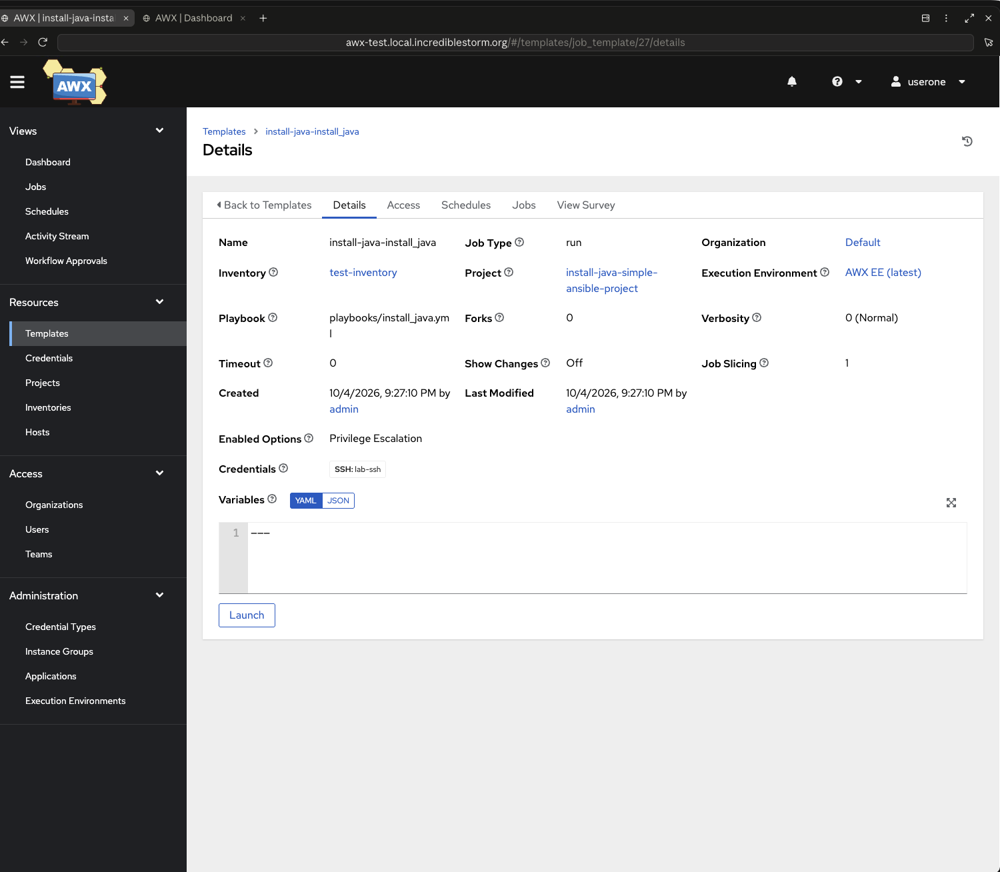
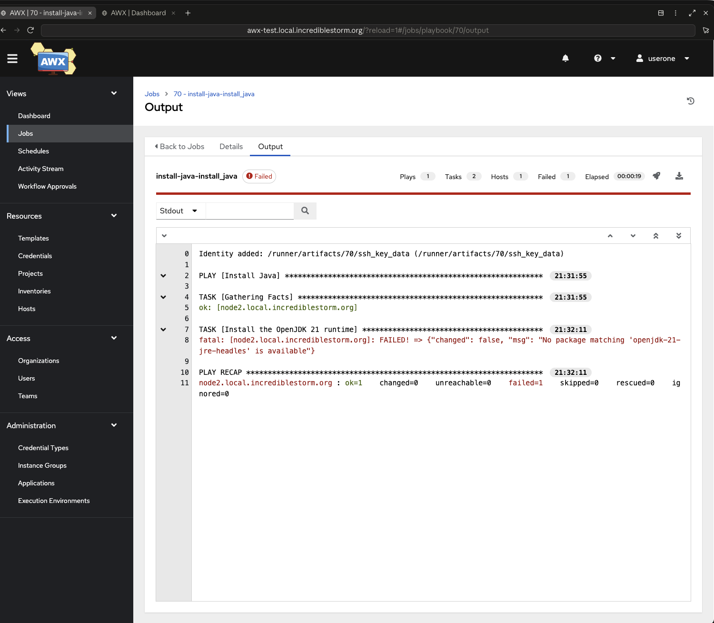
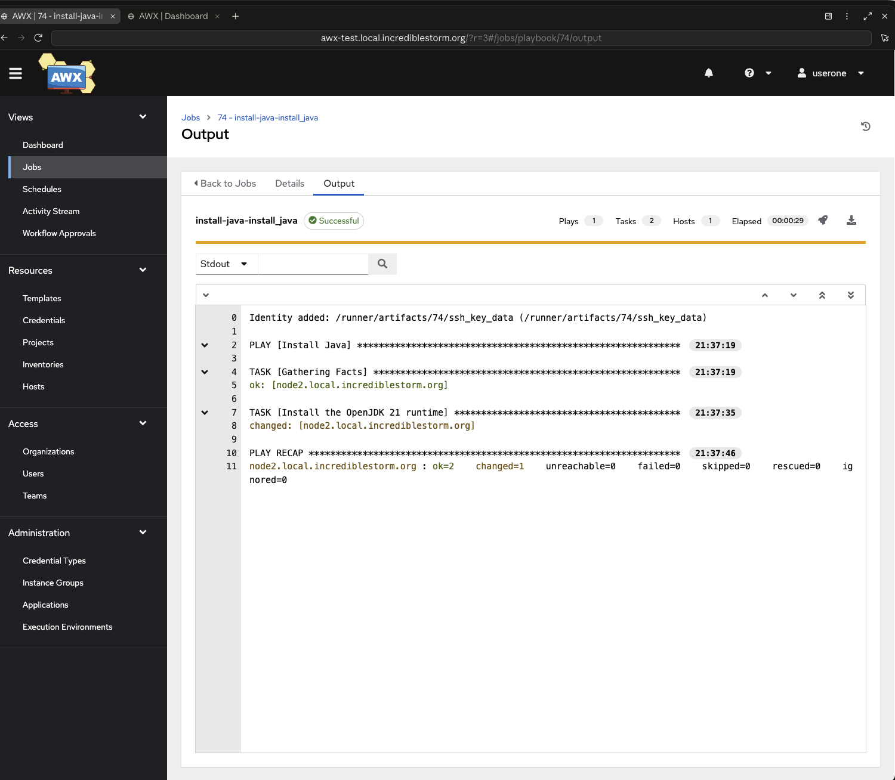
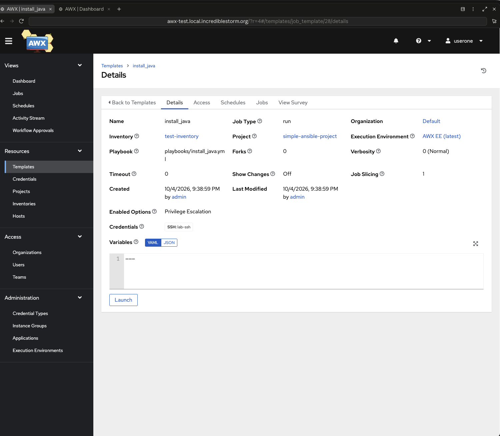
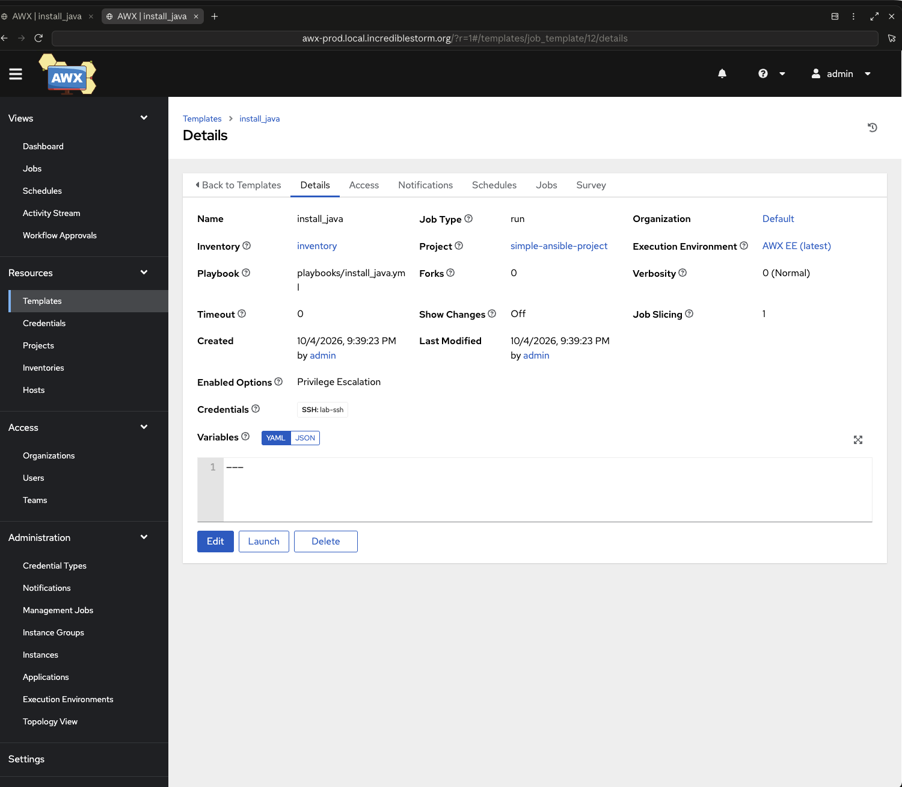

# Walkthrough: adding a playbook (install Java)

This follows one change from start to finish: an engineer adds a playbook that
installs Java, tries it on the **test** AWX server from a feature branch, hits a
mistake, fixes it, and merges it so the template also appears on **prod**.

The engineer only touches their project repo (`simple-ansible-project`). AWX
templates are created and removed by the pipeline in `central-awx`:

- push to a `feature/*` branch → the branch's templates appear on **test**,
  prefixed with the branch name (`feature/install-java` → `install-java-…`)
- merge into `main` → the templates appear on **test** and **prod**, unprefixed
- delete the branch → its prefixed templates are removed from test

On the test server the engineer (`userone`, team `engineers`) can launch
templates, which run against `test-inventory` (test hosts only).

## 1. Add the playbook and its template

On a new branch `feature/install-java`, add the playbook. It contains a
deliberate typo in the package name:

```yaml
# playbooks/install_java.yml
---
- name: Install Java
  hosts: all
  become: true
  tasks:
    - name: Install the OpenJDK 21 runtime
      ansible.builtin.apt:
        name: openjdk-21-jre-headles
        state: present
        update_cache: true
```

and one block in `awx/main.tf` that defines the AWX template:

```hcl
module "install_java" {
  source  = var.modules.job_template
  context = var.context

  name     = "install_java"
  playbook = "playbooks/install_java.yml"
  become   = true
}
```

Commit and push:

```bash
git checkout -b feature/install-java
git add playbooks/install_java.yml awx/main.tf
git commit -m "Add install_java playbook and job template"
git push -u origin feature/install-java
```

The push triggers the pipeline, which applies to the test server only
([CI run](https://github.com/Incrediblestorm/terrawx-tbranch-central-awx/actions/runs/37251433068)).

## 2. The template appears on test

Logged in to the test server as `userone`, the branch's templates are there
with the branch prefix:



`install-java-install_java` already has the test inventory, the SSH
credential and privilege escalation; none of that was written in the project:



## 3. Run it: it fails

Launching the template fails on the misspelled package:

```
fatal: [node2.local.incrediblestorm.org]: FAILED! => {"changed": false, "msg": "No package matching 'openjdk-21-jre-headles' is available"}
```



## 4. Fix it

```diff
-        name: openjdk-21-jre-headles
+        name: openjdk-21-jre-headless
```

```bash
git commit -am "Fix Java package name (openjdk-21-jre-headless)"
git push
```

The pipeline runs again and updates the test server to the new commit
([CI run](https://github.com/Incrediblestorm/terrawx-tbranch-central-awx/actions/runs/37252059169)).

## 5. Run it again: it works



## 6. Merge

Open a pull request and merge it
([PR #5](https://github.com/Incrediblestorm/terrawx-tbranch-simple-ansible-project/pull/5)).
The merge applies to test and then prod
([CI run](https://github.com/Incrediblestorm/terrawx-tbranch-central-awx/actions/runs/37252224448)),
and deleting the branch removes the `install-java-…` templates from test
([CI run](https://github.com/Incrediblestorm/terrawx-tbranch-central-awx/actions/runs/37252226154)).

The template is now `install_java` on both servers. On test it uses
`test-inventory`:



On prod it uses the full `inventory`:



## What the engineer didn't have to do

- Create, update or delete anything in AWX by hand
- Wire up the inventory or credentials
- Name templates per branch or per environment
- Clean up after the branch
